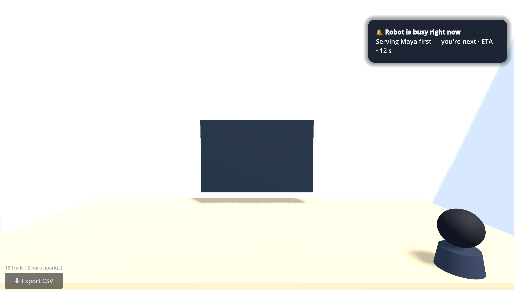

# “Hey, Over Here!” — Godot 4.6 native build

A **native [Godot 4.6](https://godotengine.org) port** of the *Hey, Over Here!* HCI study — a
voice-summoned office waste-collection robot, with the same research design as the web
(Three.js) version. The whole thing — 3D office, robot, first-person camera, **3D spatial
audio**, the six-scenario study flow, surveys, **CSV export + local persistence**, and a
**macOS-style rush-hour notification** — is built procedurally in a single `Main.gd`.

> Part of the **[“Hey, Over Here!” project](https://lyqgwzx.github.io/hey-over-here-p3/)** ·
> [Live web demo](https://lyqgwzx.github.io/hey-over-here-p3/) ·
> [Paper (PDF)](https://lyqgwzx.github.io/hey-over-here-p3/assets/paper.pdf) ·
> AP0011 Human–Computer Interaction (P3) · Li Ya · Instructor: Sahba Zojaji · SUSTech / SLAI



---

## ✨ Features

- **First-person, occluded view** — seated at your desk; you can’t see the whole office.
- **3D spatial audio (HRTF)** — the robot’s hum is positioned in space, so you locate it by ear.
- **Desk locate-light** (visual condition) — lights up when the robot locks onto you and
  flashes faster (pale-yellow → red) as it nears.
- **macOS-style rush-hour toast** — when a colleague is served first, a notification slides in
  top-right: *who* it’s serving and an **ETA**; a second toast confirms when it turns to you.
- **Full study flow** — name/ID welcome → six scenarios (balanced correct/wrong localization +
  a multi-user fairness scenario) → per-trial survey → *Next participant*.
- **Robust data** — every trial auto-saves; **CSV export** with the same columns as the web build.

## 🎮 The three conditions

| | Summon | Feedback |
|---|---|---|
| **App** (baseline) | open app → pick desk → confirm (several taps) | n/a |
| **Voice only** | say “over here” (one action) | none |
| **Voice + visual** | say “over here” | desk light shows it locked onto you |

**Measures:** interaction friction (taps), cognitive load (NASA-TLX mental demand),
calibrated trust, awareness/legibility, and perceived fairness — standard HCI instruments.

## ▶️ Run it

1. Open **Godot 4.6** (no extra dependencies).
2. **Import** this folder’s `project.godot`.
3. Press **F5** (Play).

**Controls:** drag the mouse to look around · hold the on-screen button (or **Space**) and speak,
release to summon · use headphones for the spatial audio. The study starts at the welcome
screen — there is no free-explore mode (participants always get the real test environment).

## 📊 Data

- Every completed trial auto-saves to `user://hoh_trials.json` (survives refresh / crash).
- **⬇ Export CSV** (bottom-left) writes a merged CSV and prints its absolute path. Default (macOS):
  `~/Library/Application Support/Godot/app_userdata/Hey, Over Here! (Godot)/hey_over_here_godot.csv`
- Columns match the web build (`participant_id … timestamp`).

## ✅ Headless validation

```bash
# parse + build scene/UI + simulated participant → CSV
Godot --headless --path . -- selftest      # prints SELFTEST_OK
# real robot navigation → arrival → trial completed
Godot --headless --path . -- navtest       # prints NAVTEST_OK
```

## 🛠 Notes

- Single-file procedural scene (`Main.gd`, ~950 lines) — no `.tscn` authoring beyond a stub.
- Web export is possible, but Godot 4’s threaded build needs COOP/COEP headers that GitHub Pages
  doesn’t serve — host on itch.io / Cloudflare Pages, or export single-threaded. Running locally
  has none of these limits.
